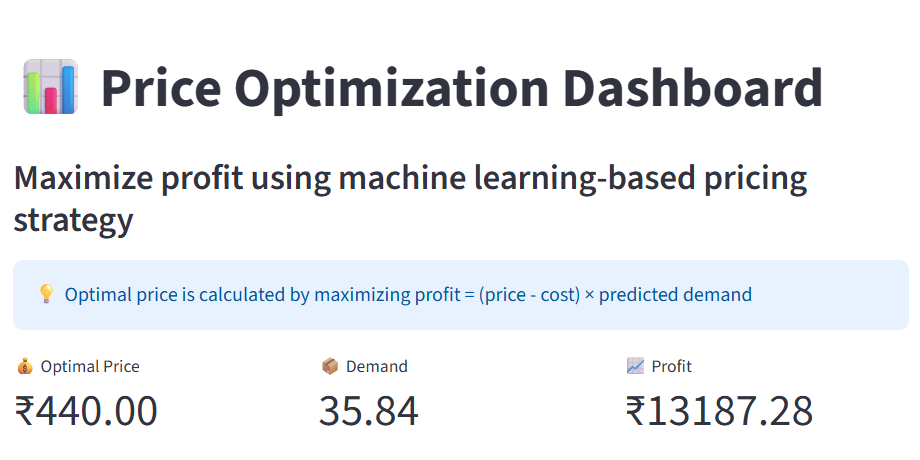
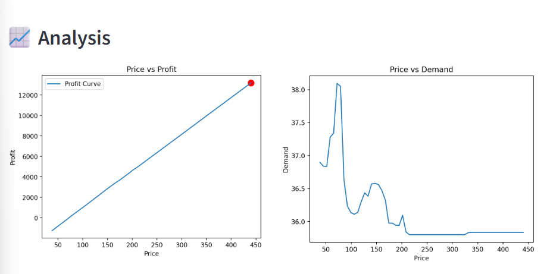
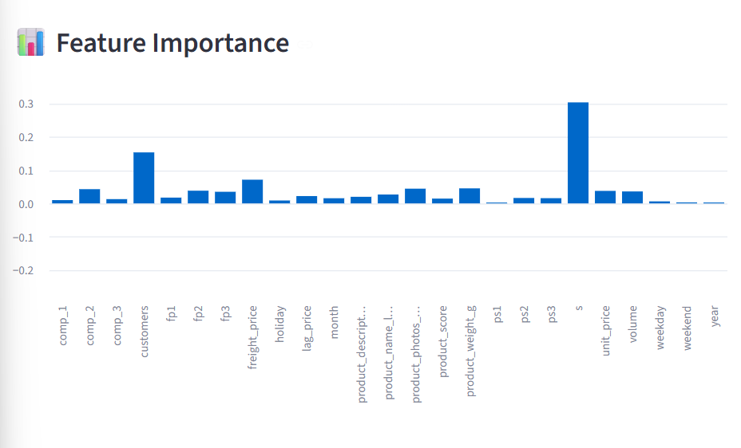
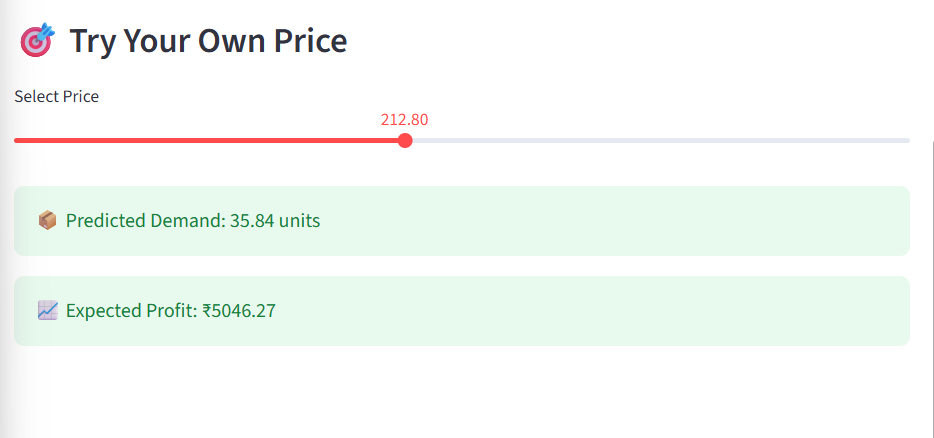
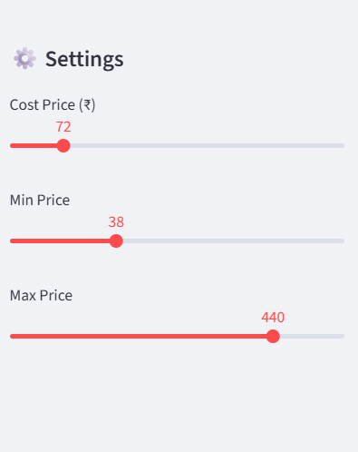

# Price Optimization System

## Overview

This project predicts product demand based on pricing and other features, and finds the optimal price that maximizes revenue.

## Technologies Used

* Python
* Pandas
* Scikit-learn
* Streamlit
* Matplotlib

## Workflow

1. Data preprocessing and feature engineering
2. Exploratory data analysis
3. Model training using RandomForest Regressor
4. Model evaluation using R² score and MSE
5. Deployment using Streamlit dashboard

## Results

* R² Score: ~0.62
* Optimal Price: ~364
* Expected Revenue: ~5622

## Run the Project

Activate environment:

```
venv\Scripts\activate
```

Run the app:

```
streamlit run src/app.py
```

Open in browser:

```
http://localhost:8501
```
## 📸 Project Demo

This dashboard allows users to simulate pricing strategies and identify the optimal price that maximizes profit using machine learning.

---

### 🔹 Dashboard Overview


---

### 🔹 Profit & Demand Analysis


---

### 🔹 Feature Importance


---

### 🔹 Price Simulation


---

### 🔹 Settings Panel

